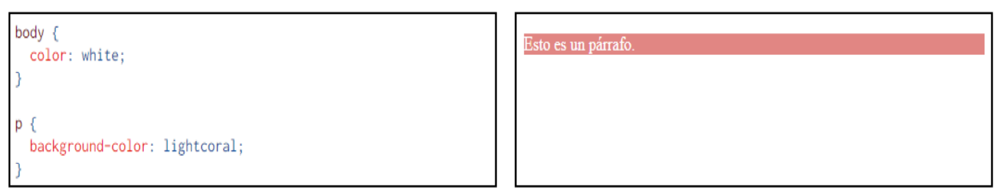

# Ejercicio 1

## 1. ¿Qué es CSS y para qué se usa?

CSS son las siglas de "Cascading Style Sheets", que se traduce como "Hojas de Estilo en Cascada". Las hojas de estilo son una tecnología que nos permite controlar la apariencia de una página web. En otras palabras, CSS es un mecanismo sencillo que describe cómo se mostrará un documento en la pantalla, cómo se imprimirá o incluso cómo se pronunciará la información presente en ese documento a través de un dispositivo de lectura. Esta forma de describir estilos proporciona a los desarrolladores un control total sobre el estilo y el formato de sus documentos.

Gracias a CSS, podemos especificar estilos como el tamaño de fuente, las fuentes utilizadas, los colores, el espaciado entre texto y elementos, así como la disposición de texto e imágenes en la página.

## 2. CSS utiliza reglas para las declaraciones de estilo, ¿cómo funcionan?

CSS funciona a través de reglas, es decir, declaraciones sobre el estilo de uno o más elementos. Las hojas de estilo están compuestas por una o más de estas reglas que se aplican a un documento HTML o XML. Cada regla consta de dos partes esenciales: un selector y una declaración. A su vez, la declaración se compone de una propiedad y el valor asignado a esa propiedad.

El selector actúa como un vínculo entre el documento y el estilo, especificando qué elementos serán afectados por esa declaración. Mientras tanto, la declaración es la parte de la regla que define qué aspecto tendrá el elemento seleccionado.

## 3. ¿Cuáles son las tres formas de dar estilo a un documento?

Existen tres formas principales de aplicar estilos a un documento:

* **Hoja de estilo externa:** Se vincula a un documento mediante el elemento `<link>`, que debe ubicarse en la sección `<head>`. Esta técnica permite mantener los estilos por separado en un archivo externo, lo que facilita la reutilización y la gestión de estilos en múltiples páginas.
* **Hoja de estilo interna:** Se utiliza el elemento `<style>` dentro del propio documento que se desea estilizar, generalmente ubicado en la sección `<head>`. Los estilos definidos de esta manera se aplican antes de que la página se cargue por completo.
* **Estilos en línea:** Los estilos se aplican directamente a elementos individuales utilizando el atributo *style* dentro de la etiqueta de cada elemento en la sección `<body>`. Sin embargo, esta técnica tiende a mezclar contenido con presentación y puede no ser tan eficiente como las hojas de estilo externas o internas, especialmente en sitios web más grandes.

## 4. ¿Cuáles son los distintos tipos de selectores más utilizados? Ejemplifique cada uno.

### Selector de tipo

El selector de tipo selecciona todos los elementos de un tipo específico.

```css
p {
    color: blue;
}
```

Este selector aplicará el color azul a todos los elementos `<p>` en la página. También se puede aplicar a otros elementos como `<h1>`, `<a>`, entre otros.

### Selector de clase

El selector de clase selecciona elementos que tienen un atributo *class* específico.

```css
.className {
    background-color: black;
}
```

Este selector aplicará un fondo negro a todos los elementos con `class="className"`.

### Selector de ID

El selector de ID selecciona un elemento con un atributo *id* específico.

```css
#encabezado {
    font-size: 24px;
}
```

Este selector aplicará un tamaño de fuente de 24px al elemento con `id="encabezado"`.

### Selector universal

El selector universal selecciona todos los elementos en la página.

```css
* {
    margin: 0;
    padding: 0;
}
```

Este selector eliminará los márgenes y el relleno predeterminados de todos los elementos en la página.

## 5. ¿Qué es una pseudo-clase? ¿Cuáles son las más utilizadas aplicadas a vínculos?

Una pseudo-clase es una palabra clave que se añade a los selectores de CSS y que especifica un estado especial o una interacción específica del elemento seleccionado. Estas pseudo-clases se escriben con dos puntos (:) antes de su nombre y permiten aplicar estilos de manera condicional a elementos HTML. A continuación, se presentan algunas pseudo-clases comunes aplicadas a vínculos junto con ejemplos:

### :link

Esta pseudo-clase se refiere a un enlace que aún no ha sido visitado por el usuario. Se utiliza para aplicar estilos a enlaces no visitados.

```css
a:link {
    color: blue;
    text-decoration: none;
}
```

### :visited

Se refiere a un enlace que ya ha sido visitado por el usuario. Puede utilizarse para cambiar el estilo de enlaces visitados.

```css
a:visited {
    color: purple;
}
```

### :hover

Esta pseudo-clase se aplica cuando el cursor del mouse se coloca sobre el enlace. Se utiliza para cambiar la apariencia del enlace cuando se interactúa con él.

```css
a:hover {
    color: red;
    text-decoration: underline;
}
```

## 6. ¿Qué es la herencia?

Principio que permite que las propiedades de estilo aplicadas a un elemento se transmitan a sus elementos secundarios (hijos) dentro de la jerarquía del documento HTML. Esto significa que si aplicas un estilo a un elemento principal, ese estilo se aplicará automáticamente a todos sus descendientes, a menos que se anule explícitamente.

La herencia en CSS funciona para muchas propiedades, como color de texto, tamaño de fuente, tipo de fuente y otras propiedades relacionadas con la tipografía. Sin embargo, no todas las propiedades se heredan; algunas propiedades, como el margen o el padding, no se heredan y deben aplicarse a cada elemento de forma individual.

Para indicar explícitamente que un elemento no debe heredar una propiedad, se utiliza la propiedad inherit.

## 7. ¿En qué consiste el proceso denominado cascada?

El formato final de cualquier elemento depende de la combinación de todas las propiedades que afectan al mismo. La denominación de hojas de estilo en cascada hace referencia precisamente a este hecho.

Por ejemplo, una de esas reglas es que a un elemento le afectan todas las propiedades de los elementos en los que está incluido, como muestra el ejemplo siguiente, en el que el color de texto del párrafo `<p>` viene determinado por la propiedad establecida para el elemento `<body>`:

